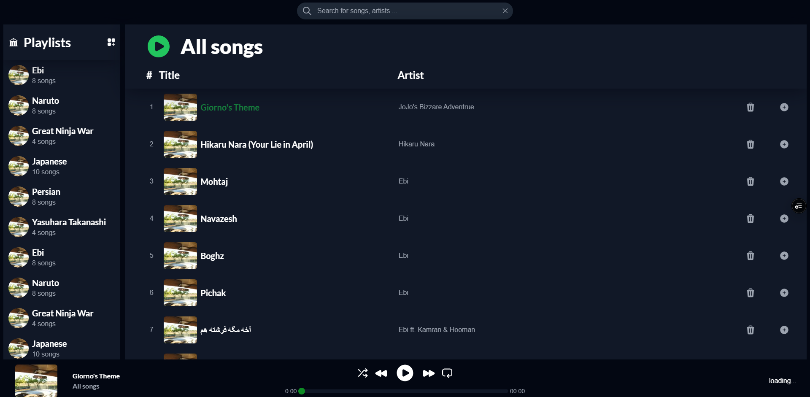

# Music Player

A simple music player built with Next.js, React, and Tailwind CSS. It allows users to create and manage playlists, play songs, and navigate through them using basic controls.

## Features
- **Search Songs**: Search for songs by artist or song name within a playlist.
- **Playlists Management**: Create, name, and manage playlists.
- **All Songs Playlist**: Access all available songs in a default playlist.
- **Song Controls**: Play, stop, skip to the next or previous song.
- **Playlist Editing**: Add or remove songs from playlists.
- **Minimalist UI**: A single-page application for easy navigation.

## Tech Stack
- **Next.js** – Server-side rendering and optimized performance.
- **React** – Component-based UI development.
- **Tailwind CSS** – Modern styling with utility-first approach.
- **Vercel** – Deployment platform for seamless hosting.

## Installation
To run the project locally, follow these steps:

1. Clone the repository:
   ```sh
   git clone https://github.com/your-username/music-player.git
   cd music-player
   ```
2. Install dependencies:
   ```sh
   npm install
   ```
3. Start the development server:
   ```sh
   npm run dev
   ```
4. Open your browser and go to `http://localhost:3000`.

## Deployment
The project is deployed on **Vercel**. You can access it here:
[Live Demo](https://react-music-player-steel.vercel.app/)

## Screenshot
Below is a screenshot of the music player interface:



---
## Author
[MaryamDar](https://github.com/marydar)

